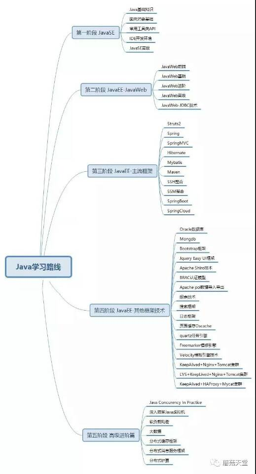

#### java学习路线：

#### java必会框架：

## jeesite4技术选型借鉴

* 主框架：Spring Boot 2.0、Spring Framework 5.0、Apache Shiro 1.4、J2Cache
* 持久层：Apache MyBatis 3.4、Hibernate Validation 6.0、Alibaba Druid 1.1
* 视图层：Spring MVC 5.0、Beetl 2.7 替换JSP、Bootstrap 3.3、AdminLTE 2.4
* 前端组件：jQuery 1.12、jqGrid 4.7、layer 3.0、zTree 3.5、jquery-validation
* 工具组件：Apache Commons、Logback 1.1、Jackson 2.8、POI 3.14、Quartz 2.2
* 技术选型详情：<http://jeesite4.mydoc.io/?t=273599>

> Spring Boot 2.0	
> Spring Framework 5.0
> Spring MVC 5.0
> Apache Shiro 1.4
	安全框架
> J2Cache	
	基于内存和Redis的两极java缓存框架，第一级缓存使用内存(同时支持 Ehcache 2.x、Ehcache 3.x 和 Caffeine)，第二级缓存使用 Redis(推荐)/Memcached 。
> Apache MyBatis 3.4
	一款优秀的持久层框架，它支持定制化 SQL、存储过程以及高级映射
> Hibernate Validation 6.0
	Bean 验证框架，用Annotations 给类或者类的属性加上约束(constraint)。创建实体类的时候生成数据表的时候用
> Alibaba Druid 1.1	
	DRUID是阿里巴巴开源平台上一个数据库连接池实现，它结合了C3P0、DBCP、PROXOOL等DB池的优点，同时加入了日志监控，可以很好的监控DB池连接和SQL的执行情况，可以说是针对监控而生的DB连接池。
> Beetl 2.7
	模板引擎，功能强大，性能良好
> Apache Commons
	包含很多java开源工具类，如email发送(对javamail的封装)、DBCP数据库连接池、fielupload文件上传功能、io工具的封装、logging日志接口等等
> Logback 1.1
	springboot日志框架
> Jackson 2.8
	处理json和xml格式化的类库
> POI 3.14
	提供API给Java程序对office格式档案读写功能
> Quartz 2.2
	任务调度框架，在某一个规律的时间点干某件事
> Bootstrap 3.3
	前端框架
> AdminLTE 2.4
	后台模板，基于bootstrap3，有很多常用模板样式供使用
> jQuery 1.12
	前端js库
> jqGrid 4.7
	jquery基础上做得一个前端表格控件，以ajax的方式和服务器通信
> layer 3.0
	前端弹出框
> zTree 3.5
	依靠jquery实现的的多功能树插件
> jquery-validation	
	前端表单验证	
	
	
	
	
	
	
	
	
	
	
	
	
	
	
	
	
	